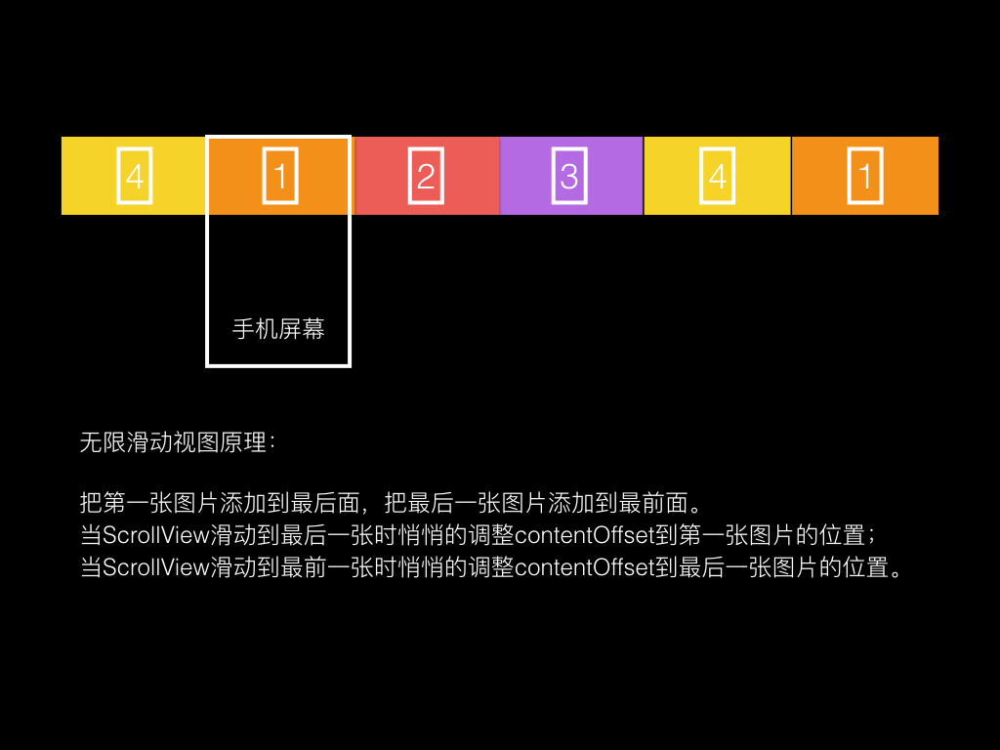

# LioLoopScrollView
无限轮播视图
###使用方法
#### Cocoapods

```
platform :ios, "9.0" 
pod "LioLoopScrollView"
use_frameworks!

```
#### 手动
第一步 初始化

```
       let lioView = LioLoopView(frame: CGRectMake(0, 20, CGRectGetWidth(self.view.bounds),100))
        self.view.addSubview(lioView)
        lioView.delegate = self
        lioView.setLioScrollViewImageWithURLsArray(
            [
                "http://7xpsn4.com1.z0.glb.clouddn.com/1.jpg",
                "http://7xpsn4.com1.z0.glb.clouddn.com/2.png",
                "http://7xpsn4.com1.z0.glb.clouddn.com/3.jpg",
                "http://7xpsn4.com1.z0.glb.clouddn.com/4.png",
                "http://7xpsn4.com1.z0.glb.clouddn.com/5.png",
                "http://7xpsn4.com1.z0.glb.clouddn.com/6.png",
            ]
        )
    
```
第二步 代理

```
    func lioScrollViewClickAtIndex(index: NSInteger) {
            print("点击了第\(index)张")
   }
```


###效果图


###原理图


 <div align='center'>
          
 </div>